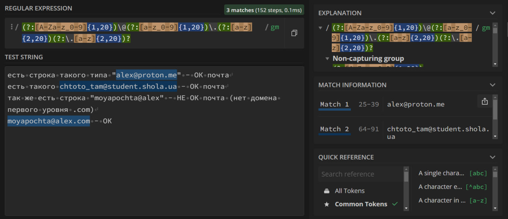
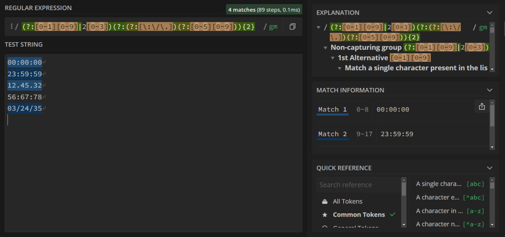
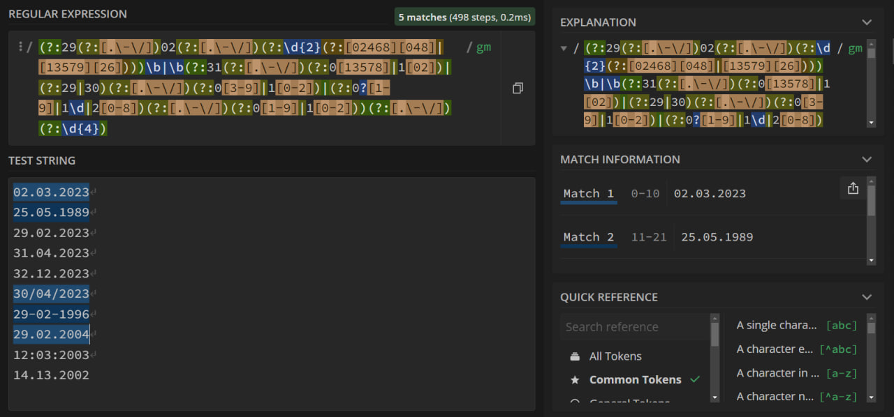
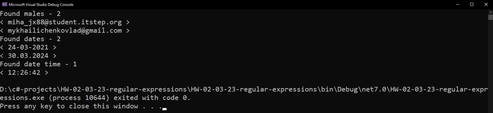

# Дз от 02/03/23. Regular Expressions
##  **Задание 1.** Cоставить регулярное выражение, которое проверяет корректность электронной почты.
<br/>

> **sample**
> #### XXXXXXXX@YYYYYYYY.QQQQQQ <br/> XXXXXXXX - буквы и цифры + нижние подчёркивания от 1 до 20 символов <br/> YYYYYYYY - буквы и цифры + нижние подчёркивания от 1 до 20 символов <br/> QQQQQQ - буквы от 2 до 20 символов.
<br/> 

> **regexp**
> ```cs
> (?:[A-Za-z_0-9]{1,20})\@(?:[a-z_0-9]{1,20})\.(?:[a-z]{2,20})(?:\.[a-z]{2,20})?
> ```

### Результат:

____
##  **Задание 2.** Найти в тексте ВСЕ корректные упоминания времени в формате ЧЧ:ММ:СС.
<br/>

> **sample**
> #### 00:00:00 - ОК <br/> 23:59:59 - ОК <br/> 56:67:78 - дичь
<br/> 

> **regexp**
> ```cs
> (?:[0-1][0-9]|2[0-3])(?:(?:[\:\/\.])(?:[0-5][0-9])){2}
> ```

### Результат:

____
##  **Задание 3.** Найти в тексте ВСЕ корректные упоминания дат в формате ДД.ММ.ГГГГ.
<br/>

> **sample**
> #### 02.03.2023 - ОК <br/> 25.05.1989 - ОК <br/> 29.02.2023 - дичь <br/> 31.04.2023 - дичь <br/> 32.12.2023 - дичь
<br/>

> **regexp**
> ```cs
> (?:29(?:[.\-\/])02(?:[.\-\/])(?:\d{2}(?:[02468][048]|[13579][26])))\b|\b(?:31(?:[.\-\/])(?:0[13578]|1[02])|(?:29|30)(?:[.\-\/])(?:0[3-9]|1[0-2])|(?:0?[1-9]|1\d|2[0-8])(?:[.\-\/])(?:0[1-9]|1[0-2]))(?:[.\-\/])(?:\d{4})
> ```
> #### Регулярное выражение состоит из двух частей. Первая часть это проверка на високосный год:
> ```cs
> (?:29(?:[.\-\/])02(?:[.\-\/])(?:\d{2}(?:[02468][048]|[13579][26])))\b
> ```
> #### Вторая - проверка корректности даты не являющейся високосной:
> ```cs
> \b(?:31(?:[.\-\/])(?:0[13578]|1[02])|(?:29|30)(?:[.\-\/])(?:0[3-9]|1[0-2])|(?:0?[1-9]|1\d|2[0-8])(?:[.\-\/])(?:0[1-9]|1[0-2]))(?:[.\-\/])(?:\d{4})
> ```

### Результат:

____
> ## Парсинг строки с использованием Regex и MatchCollection
```cs
string mailRegexp = @"(?:[A-Za-z_0-9]{1,20})\@(?:[a-z_0-9]{1,20})\.(?:[a-z]{2,20})(?:\.[a-z]{2,20})?";
string dateRegexp = @"(?:29(?:[.\-\/])02(?:[.\-\/])(?:\d{2}(?:[02468][048]|[13579][26])))\b|\b(?:31(?:[.\-\/])(?:0[13578]|1[02])|(?:29|30)(?:[.\-\/])(?:0[3-9]|1[0-2])|(?:0?[1-9]|1\d|2[0-8])(?:[.\-\/])(?:0[1-9]|1[0-2]))(?:[.\-\/])(?:\d{4})";
string timeRegexp = @"(?:[0-1][0-9]|2[0-3])(?:(?:[\:\/\.])(?:[0-5][0-9])){2}";

string line = "Login: miha_jx88@student.itstep.org" +
    "Mail: mykhailichenkovlad@gmail.com" +
    "Date registration: 24-03-2021T12:26:42" +
    "End date: 30.03.2024";

MatchCollection mailCollection = new Regex(mailRegexp).Matches(line);
MatchCollection dateCollection = new Regex(dateRegexp).Matches(line);
MatchCollection timeCollection = new Regex(timeRegexp).Matches(line);

Console.WriteLine($"Found males - {mailCollection.Count}");
foreach (Match mail in mailCollection)
    Console.WriteLine($"< {mail.Value} >");

Console.WriteLine($"Found dates - {dateCollection.Count}");
foreach (Match date in dateCollection)
    Console.WriteLine($"< {date.Value} >");

Console.WriteLine($"Found date time - {timeCollection.Count}");
foreach (Match time in timeCollection)
    Console.WriteLine($"< {time.Value} >");
```

